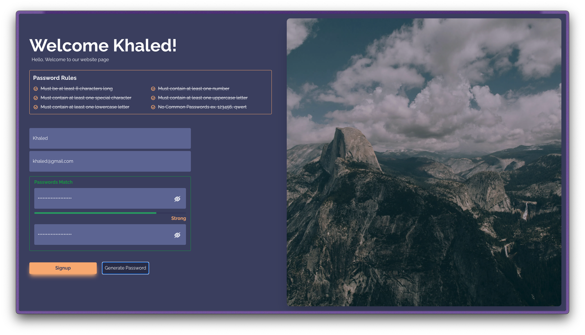

## SignUp Page

### Description

This is a simple SignUp page that focuses on password strength. It uses a password strength meter to show the strength of the password entered by the user. The password strength meter is a simple bar that changes color based on the strength of the password. The password strength is calculated based on the length of the password, the presence of uppercase and lowercase letters, numbers, special characters, and more. The password strength meter is updated in real-time as the user types in the password. The password strength meter is a simple and effective way to encourage users to create strong passwords.

also it generate a strong password for the user if he wants to.

### Technologies

- HTML
- Tailwind CSS
- TypeScript
- Next.js

### Done By

- Khaled Almansour